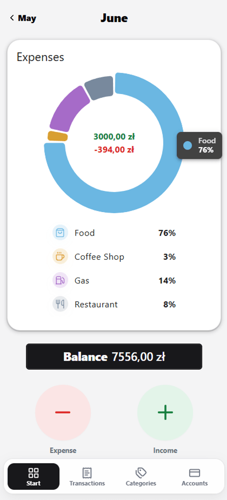
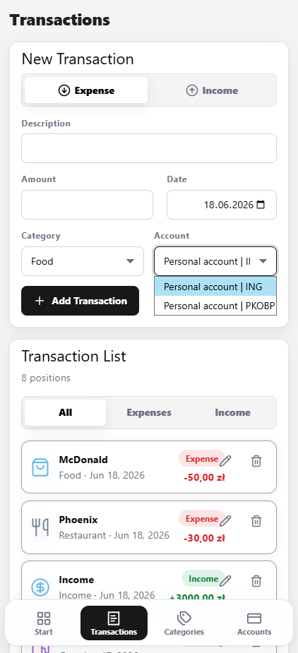
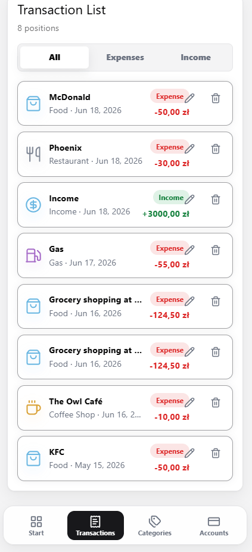
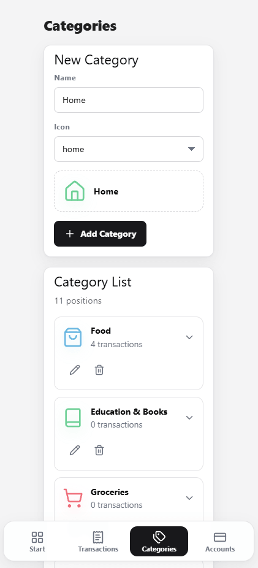
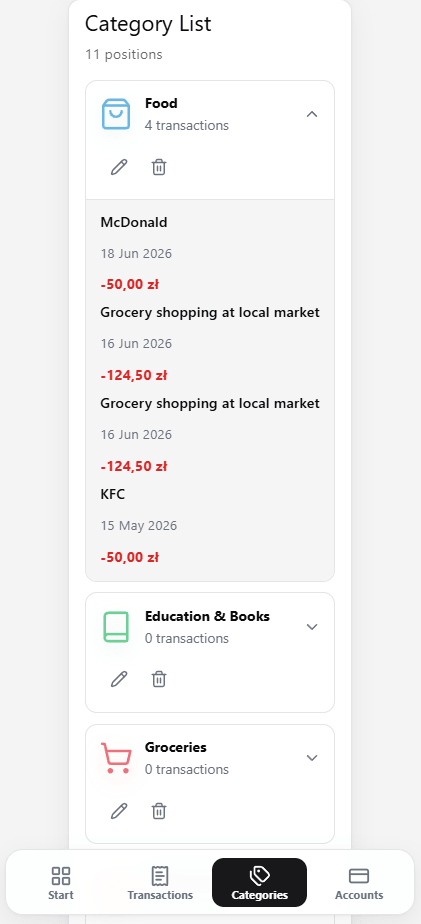
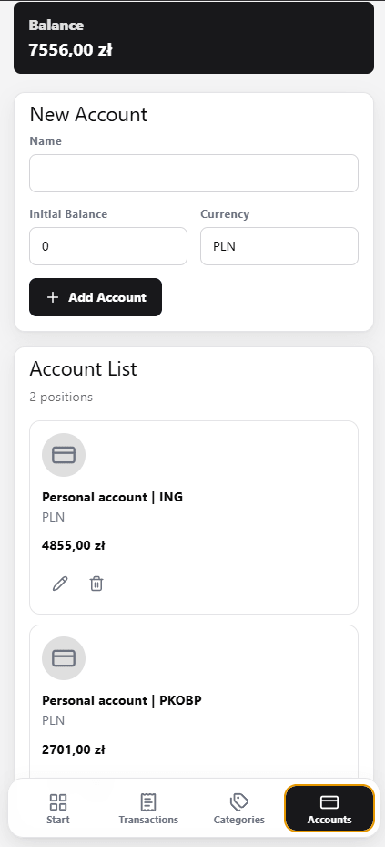

# Fluxo


**Your budget app.**

> ⚠️ **This project is under active development.** Features, the data model, and the API may still change. Use it for personal purposes.

Fluxo is a personal finance and budget-tracking web application. It helps you log income and expenses, organize spending into categories, track balances across multiple accounts, and see exactly where your money goes each month at a glance.

---

## Features

### Dashboard

- Month-by-month navigation — browse past months freely (navigating into a future month that hasn't happened yet is disabled).
- Monthly expenses visualized as an interactive donut chart with a custom legend: every category is shown with its own icon, name, and share of total spending.
- Hover a chart slice for a quick tooltip with the category name and percentage.
- At-a-glance balance summary for the selected month.
- One-tap quick actions to add a new expense or income transaction.



### Transactions

- Add transactions as either an **Expense** or **Income**, with a description, amount, date, category, and account.
- Browse the full transaction list, filterable by **All / Expenses / Income**.
- Edit or delete any transaction.

<p>
  
  
</p>

### Categories

- Create categories with a name and an icon, with a live preview of how the category will look before saving.
- The category list shows how many transactions are recorded against each category.
- Expand any category inline to see its individual transactions — description, date, and amount — without leaving the page.
- Edit or delete a category at any time.

<p>
  
  
</p>

### Accounts

- Create accounts (e.g. a bank account or cash) with a name, an initial balance, and a currency.
- The account list shows the current balance of every account at a glance.
- Edit or delete an account at any time.



---

## Tech Stack

| Layer          | Technology                                          |
| -------------- | --------------------------------------------------- |
| Frontend       | Vue 3, TypeScript, Vite, Vue Router, Pinia, Vuetify |
| Backend        | .NET (ASP.NET Core Web API)                         |
| Database       | PostgreSQL                                          |
| Infrastructure | Docker & Docker Compose                             |

The frontend, backend, and database are containerized and orchestrated together with a single `docker-compose.yml`, so the whole stack can be brought up with one command.

---

## Getting Started

### Prerequisites

- [Docker](https://www.docker.com/) and [Docker Compose](https://docs.docker.com/compose/)

### Running locally

1. Clone the repository:

   ```bash
   git clone https://github.com/MarekKaczmarski/Fluxo.git
   cd Fluxo
   ```

2. Start the full stack (database, API, and frontend) with Docker Compose:

   ```bash
   docker compose up --build
   ```

   This spins up three containers:

   | Service          | Container        | Exposed at            |
   | ---------------- | ---------------- | --------------------- |
   | `fluxo-frontend` | Vue app          | http://localhost:5173 |
   | `fluxo-api`      | ASP.NET Core API | http://localhost:7001 |
   | `fluxo-db`       | PostgreSQL 16    | `localhost:5432`      |

3. Open the app in your browser:

   ```
   http://localhost:5173
   ```

4. To stop the stack:

   ```bash
   docker compose down
   ```

   Add `-v` if you also want to drop the Postgres data volume (`fluxo-data`) and start from a clean database next time.

> **Note:** The default database credentials and connection string in `docker-compose.yml` (`admin` / `secret_pass`, database `fluxo_db`) are meant for local development only.

---

## Project Structure

The backend follows Clean Architecture, split into four projects under the root `Fluxo` solution; the frontend lives alongside it as its own Vite project.

```
Fluxo/
├── Fluxo.Api/               # ASP.NET Core Web API — application entry point
├── Fluxo.Application/       # Application layer (use cases, services, DTOs)
├── Fluxo.Domain/            # Domain layer (entities, core business rules)
├── Fluxo.Infrastructure/    # Infrastructure layer (EF Core, PostgreSQL, external concerns)
├── Fluxo.Client/
│   └── fluxo/               # Vue 3 + TypeScript frontend
│       └── src/
│           ├── components/  # Reusable UI components (charts, cards, buttons, icons, ...)
│           ├── views/       # Page-level views (Dashboard, Categories, Accounts, Transactions)
│           ├── stores/      # Pinia stores
│           ├── api/         # API client & DTOs
│           └── router/      # Vue Router configuration
└── docker-compose.yml       # Orchestrates the frontend, API, and database
```

---

## License

This project is licensed under the [MIT License](LICENSE).
